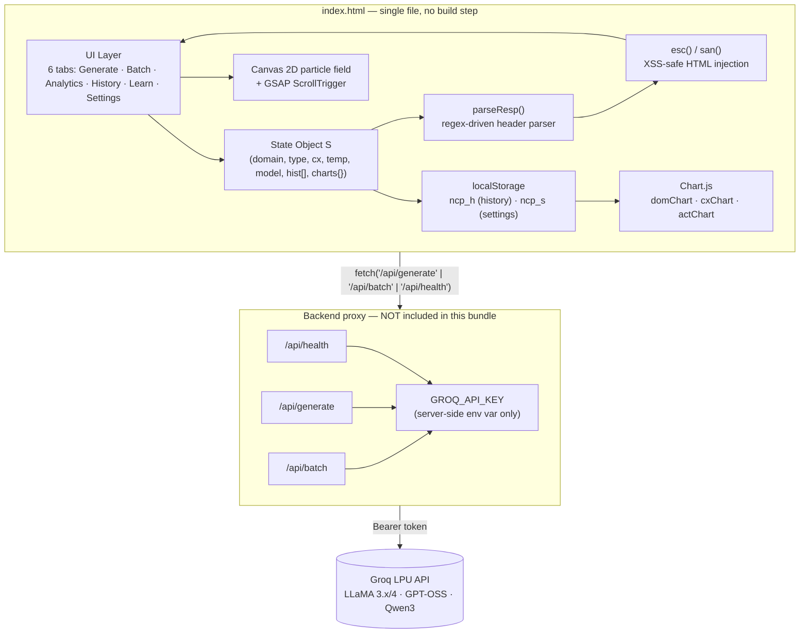
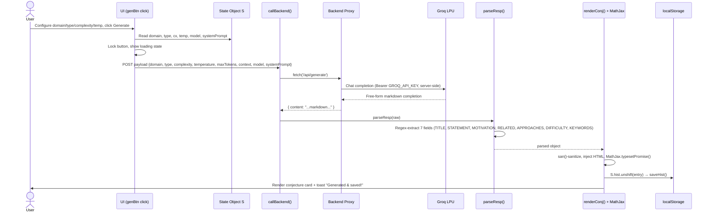

<div align="center">


[](#)
[](#)
[](#)
[](#)
[](#)
[](#license)

 was written after a full line-by-line pass of `index.html` (3,552 lines). Every metric, function name, and line range below was extracted directly from the source with `grep`/`awk`, not estimated. Where the implementation has real costs, they're documented in [Engineering Review](#-engineering-review--honest-trade-offs) rather than glossed over.

## What This Actually Is

A single HTML file that turns an LLM into a **constrained conjecture-generation instrument** rather than an open-ended chatbot. The constraint surface is a discrete parameter grid — **8 domains × 7 statement types × 4 complexity tiers × a continuous temperature dial** — paired with a strict markdown header contract (`**STATEMENT**:`, `**MOTIVATION**:`, etc.) that the client deterministically parses back into seven structured fields with a single parameterized regex. Everything downstream — LaTeX rendering, history persistence, analytics, batch runs, sharing — is built on top of that one parsing contract.

There is no framework runtime, no bundler, no `node_modules`. Every third-party capability (Bootstrap, MathJax, Chart.js, GSAP) is a CDN tag, and the entire client — UI state, history, settings, six tab controllers, two chart-driven analytics views, and the canvas particle field — lives in one inline `<script>` block.

> **A note on the animated visuals in this README:** the banner, the section dividers, and the lifecycle diagram are hand-built SVGs, not screen-recorded GIFs — `assets/banner.svg`, `assets/flow.svg`, and `assets/divider.svg` total **~13.6 KB combined**, lighter than a single typical demo GIF frame. Every color in them (`#c9a227` gold, `#00d4f5` cyan, `#7c3aed` purple, `#04040a` void) is lifted directly from the app's own `:root` design tokens, and the orbiting-symbol motif mirrors the app's actual `.hero-orbital` component — so the README's visual identity is generated *from* the codebase's own design system, not a generic template bolted on top. All three respect `prefers-reduced-motion` and the below-the-fold diagram is lazy-loaded — see [Asset Performance Notes](#asset-performance-notes) for the specifics.

---

## 📊 Codebase At a Glance

| Metric | Value |
|---|---|
| Total lines | **3,552** |
| Named JS functions (incl. nested) | **51** |
| CSS custom properties in `:root` | **45** |
| `@keyframes` animation definitions | **23** |
| Responsive `@media` breakpoints | **7** (400 / 768 / 992 / 1400 / 1800px + print) |
| External CDN dependencies | **10** (fonts, Bootstrap CSS+JS+Icons, MathJax, Chart.js, GSAP+ScrollTrigger) |
| `localStorage` read/write call sites | **5** |
| Inline `onclick` event bindings | **54** |
| `addEventListener` calls | **6** |
| Build tooling required | **0** |

---

## 🏗 System Architecture



**Why the indirection through a backend?** The Settings tab states it outright: *the Groq key lives server-side via environment variables and is never exposed to the browser.* A static HTML file calling Groq directly would put the API key in plaintext in every network request a user's devtools can see — so the three-endpoint contract below exists specifically as a credential boundary, not as incidental architecture.

---

## 🗺 Codebase Anatomy (line-accurate)

Every section below is a real comment banner in the source, with its real starting line — the actual table of contents of the file, useful for code review or onboarding.

<details>
<summary><strong>CSS — 21 sections, lines 34–2106</strong></summary>

| § | Section | Starts at |
|---|---|---|
| 1 | CSS Custom Properties — Design Tokens | `L36` |
| 2 | Reset & Base | `L112` |
| 3 | Navbar — Mobile-First, Bootstrap Integrated | `L155` |
| 4 | Hero Section — Mathematical Observatory | `L383` |
| 5 | Ticker | `L826` |
| 6 | App Framework — Tabs, Sections | `L855` |
| 7 | Cards & Containers | `L905` |
| 8 | Form Controls | `L954` |
| 9 | Domain Grid & Chips | `L1067` |
| 10 | Generate Output | `L1145` |
| 11 | Batch Tab | `L1420` |
| 12 | Analytics | `L1488` |
| 13 | History | `L1516` |
| 14 | Learn Tab | `L1553` |
| 15 | Settings | `L1560` |
| 16 | Modal | `L1641` |
| 17 | Toast | `L1704` |
| 18 | Footer | `L1743` |
| 19 | Utilities & Animations | `L1783` |
| 20 | Responsive — Mobile First | `L1811` |
| 21 | Print | `L1997` |

</details>

<details>
<summary><strong>JavaScript — 25 sections, lines 2655–3535</strong></summary>

| § | Section | Starts at | Key functions |
|---|---|---|---|
| 1 | Constants | `L2655` | `DEFAULT_MODEL`, `VALID_MODELS` |
| 2 | State | `L2669` | `S` |
| 3 | Helpers | `L2702` | `getMaxTok`, `esc`, `san`, `diffCls`, `fmtDate` |
| 4 | Settings | `L2736` | `loadSettings`, `saveSettings`, `selModel` |
| 5 | History Persistence | `L2812` | `saveHist`, `loadHist` |
| 6 | Backend API | `L2821` | `callBackend` |
| 7 | Prompt Builders | `L2852` | `buildSys`, `buildUser` |
| 8 | Parse Response | `L2874` | `parseResp` |
| 9 | Render Conjecture | `L2893` | `renderConj` |
| 10 | Generate (Single) | `L2924` | `generateConjecture` |
| 11 | Batch Generation | `L2998` | `runBatch` |
| 12 | Modal | `L3093` | `showMod`, `closeMod` |
| 13 | History — CRUD | `L3107` | `renderHist`, `filterHist`, `exportHist`, `importHist` |
| 14 | Conjecture Actions | `L3208` | `likeConj`, `copyConj`, `shareConj` |
| 15 | Analytics | `L3256` | `renderAnalytics` |
| 16 | Selectors | `L3337` | `selDomain`, `selType` |
| 17 | Tab Navigation | `L3351` | `switchTab` |
| 18 | Status / Toast | `L3365` | `setStat`, `toast` |
| 19 | Scroll / Hero | `L3383` | `scrollToHero`, `updHeroTotal` |
| 20 | Canvas Particles | `L3395` | `initCanvas`, `draw` |
| 21 | Ticker | `L3432` | `initTicker` |
| 22 | Learn | `L3455` | `initLearn`, `togLearn` |
| 23 | LaTeX Reference | `L3497` | `initLatex` |
| 24 | Keyboard Shortcuts | `L3524` | — |
| 25 | Init | `L3535` | `DOMContentLoaded` bootstrap |

</details>

---

## 🔁 Generation Request Lifecycle


<div align="center">

</div>

The animation above is intentionally honest about what it is: a looping, stylized illustration of the pipeline, not a literal single-request timeline. For the precise, literal version — exact call order, payload shapes, what happens on failure — here's the same path as a sequence diagram:



The same `parseResp` → `san()` → MathJax pipeline is reused, unmodified, by `runBatch()` for up to 5 concurrent conjecture cards — single-generation and batch-generation share 100% of their rendering/parsing logic and diverge only in which endpoint is called (`/api/generate` vs `/api/batch`).

---

## 🔌 Backend API Contract

The frontend is backend-agnostic — implement these three endpoints in any stack and the UI works unmodified.

### `GET /api/health`
```json
{ "keyConfigured": true }
```

### `POST /api/generate`
```jsonc
// → Request
{
  "domain": "Number Theory", "type": "Existence", "complexity": "Graduate",
  "temperature": 0.7, "maxTokens": 1200, "context": "",
  "model": "llama-3.3-70b-versatile", "systemPrompt": "You are a world-class mathematician…"
}
// ← Response (content is parsed client-side by parseResp())
{ "content": "**CONJECTURE TITLE**: …\n**STATEMENT**: …\n**MOTIVATION**: …" }
```

### `POST /api/batch`
```jsonc
// → Request: { domain, count, complexity, temperature, maxTokens, context, model, systemPrompt }
// ← Response
{ "results": [
  { "ok": true,  "domain": "Topology", "type": "Structural", "content": "**CONJECTURE TITLE**: …" },
  { "ok": false, "error": "rate limited" }
]}
```

<details>
<summary><strong>Minimal reference implementation (Node/Express)</strong></summary>

```js
app.post('/api/generate', async (req, res) => {
  const { systemPrompt, domain, type, complexity, context, model, temperature, maxTokens } = req.body;
  const r = await fetch('https://api.groq.com/openai/v1/chat/completions', {
    method: 'POST',
    headers: { Authorization: `Bearer ${process.env.GROQ_API_KEY}`, 'Content-Type': 'application/json' },
    body: JSON.stringify({
      model, temperature, max_tokens: maxTokens,
      messages: [
        { role: 'system', content: systemPrompt },
        { role: 'user', content: `Generate a novel ${type.toLowerCase()} conjecture in ${domain}. Difficulty: ${complexity}-level. ${context}` }
      ]
    })
  });
  const data = await r.json();
  res.json({ content: data.choices[0].message.content });
});
```

</details>

---

## 🔬 Engineering Review — Honest Trade-Offs

A real review calls out cost as well as benefit. Both are here.

### Strong patterns

| Pattern | Where | Why it matters |
|---|---|---|
| **Regex header-parsing instead of JSON mode** | `parseResp()` — one regex: `` /\*\*${k}\*\*:?\s*([\s\S]*?)(?=\*\*[A-Z]\|$)/i `` | Degrades gracefully — a missing section renders empty instead of throwing, which matters because LLM output format compliance is never 100%. |
| **Two-tier output sanitization** | `esc()` for plain text, `san()` for AI-sourced HTML (strips `<script>` + inline `on*` handlers) | The threat model is explicit: LLM output is a lower-trust input, even though it's "your own" AI — `san()` exists specifically for that boundary. |
| **Chart lifecycle hygiene** | `renderAnalytics()` calls `.destroy()` on all three Chart.js instances before recreating them | Prevents the canonical Chart.js memory leak from re-instantiating on a canvas that already has a chart bound to it. |
| **Self-healing settings** | `loadSettings()` validates the persisted model ID against `VALID_MODELS` on every load | If Groq deprecates a model string, a stale `localStorage` entry can't permanently brick generation — it silently falls back to `DEFAULT_MODEL`. |
| **Progressive enhancement on share** | `shareConj()` tries `navigator.share()`, falls back to `navigator.clipboard.writeText()` | One code path correctly covers mobile share-sheet and desktop clipboard without feature-detection branching at the call site. |
| **Passive scroll listener** | `window.addEventListener('scroll', ..., { passive: true })` | Tells the browser this handler will never call `preventDefault()`, avoiding scroll-jank from a blocked compositor thread. |

### Known costs / things to flag in a real review

| Observation | Detail | Why it's worth knowing |
|---|---|---|
| **O(n²) particle connection check** | `initCanvas()`'s `draw()` loop compares all pairs of 55 particles every frame (1,485 distance checks/frame, uncapped at `requestAnimationFrame` rate) | Fine at n=55, but the algorithm doesn't scale — a future "denser background" request would need a spatial grid/quadtree, not a bigger `n`. |
| **Resize listener is not debounced** | `window.addEventListener('resize', ...)` directly re-reads `innerWidth/innerHeight` on every event | Harmless here since the handler is cheap, but it's the kind of unthrottled listener that becomes a real cost if more work gets added to it later. |
| **54 inline `onclick` attributes** | Throughout the markup, e.g. `onclick="selDomain(this)"` | A deliberate trade-off for a zero-build single file (no need to wire up listeners after dynamic re-render), but it does mean all handler functions must stay on `window` scope — this would need to change before any move to modules/bundling. |
| **History has no schema version field** | `S.hist` entries are plain objects persisted directly to `localStorage` | Works today, but adding a new field to history entries later has no migration path for existing users' saved data. |
| **No automated tests** | The entire 51-function surface, including the parsing regex that everything else depends on, has zero test coverage in this file | `parseResp()` is the single highest-leverage function to break silently (e.g. if a model changes its markdown formatting) — it's also the easiest to unit test in isolation. |

---

## 🚀 Getting Started

```bash
git clone https://github.com/<your-username>/mathematical-conjecture-proposer.git
cd mathematical-conjecture-proposer

# Stand up any backend implementing the 3-endpoint contract above,
# with GROQ_API_KEY set in its environment — see reference snippet above.

npx serve .          # zero-build static serve, or open index.html directly
```

Then: **Settings → Test Backend** to confirm `keyConfigured: true`, pick a model card, hit **Generate Conjecture**.

---

## ✦ Full Feature List

- **Multi-model switcher** — `llama-3.3-70b-versatile`, `llama-3.1-8b-instant`, `openai/gpt-oss-120b`, `openai/gpt-oss-20b`, `meta-llama/llama-4-scout-17b-16e-instruct`, `qwen/qwen3-32b`
- **8 domains × 7 types × 4 complexity tiers** parametric generation grid, plus continuous 0.1–1.5 temperature control
- **Editable system prompt** with `{domain}` `{type}` `{complexity}` `{context}` interpolation
- **Batch mode** — 2–5 conjectures per run, live progress bar, per-item failure isolation, "Mixed" domain option
- **MathJax 3** rendering of every statement, lazily re-typeset on tab switch / accordion expand
- **History** — search, per-domain filter chips, like/save, JSON export & re-import, native share + clipboard fallback
- **Analytics** — doughnut (domain distribution), bar (complexity breakdown), line chart (real 7-day rolling activity computed from history timestamps)
- **Learn hub** — accordion covering Riemann Hypothesis, Goldbach, Twin Primes, P vs NP, Poincaré, Birch & Swinnerton-Dyer, plus a 12-symbol click-to-copy LaTeX cheat sheet
- **Ambient canvas** — 55 animated mathematical glyphs with proximity-based connective lines; infinite marquee ticker of 12 famous theorems/identities
- **GSAP + ScrollTrigger** — hero entrance timeline, scroll-scrubbed parallax, staggered section reveals
- **Accessibility** — `aria-hidden` on every decorative layer, `aria-label`/`role="button"` on custom interactive elements, dedicated print stylesheet

---

## 🛠 Tech Stack

| Layer | Technology |
|---|---|
| Markup / Styling | Semantic HTML5, Bootstrap 5.3, custom CSS design-token system, CSS `@property` for typed animatable values |
| Typography | Cormorant Garamond (display), DM Sans / Inter (UI), JetBrains Mono (code/math) |
| Math | MathJax 3 (TeX → CHTML) |
| Charts | Chart.js 4 |
| Motion | GSAP 3 + ScrollTrigger, CSS keyframes, Canvas 2D |
| State / Persistence | Vanilla JS, `localStorage` |
| Inference | Groq LPU (LLaMA 3.x/4, GPT-OSS, Qwen3) |
| Backend | Bring your own — 3-endpoint contract above |
| README visuals | Hand-authored animated SVG (`assets/banner.svg`, `assets/flow.svg`) — CSS keyframes + `offset-path`, no GIFs |

---

## 🗺 Roadmap

- [ ] Unit tests for `parseResp()` against real model output samples (highest-leverage function, zero current coverage)
- [ ] Reference backend (Express + serverless variants) committed to `/server`
- [ ] Spatial partitioning for the particle field if density increases beyond current O(n²) budget
- [ ] Streaming token rendering (SSE) for generation
- [ ] History schema versioning for safe future migrations
- [ ] Formal verification sketch hooks (Lean/Coq) per conjecture

## 🤝 Contributing

Issues and PRs welcome. For anything beyond a trivial fix, please open an issue describing the change first.

## 📄 License

MIT — see [`LICENSE`](LICENSE).

---

<div align="center">
<sub>All conjectures are AI-generated starting points for exploration, not verified mathematics — every output requires expert review before any claim of correctness.</sub>
</div>
